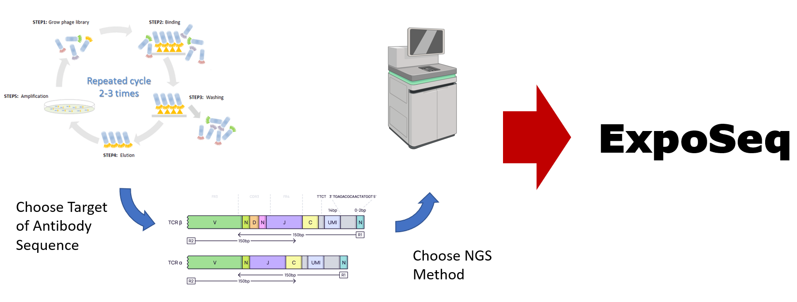
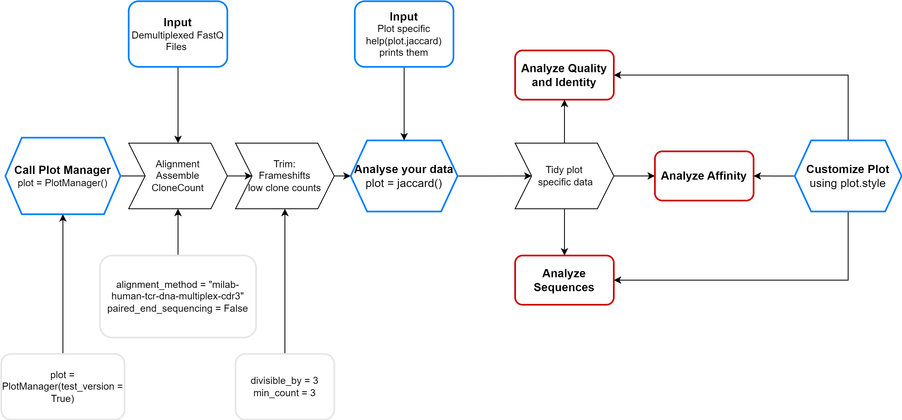

# Welcome to ExpoSeq

ExpoSeq is a powerful pipeline for processing and analyzing FASTQ files from sequencing phage Display panning samples. It utilizes [MiXCR](https://docs.milaboratories.com/mixcr/getting-started/installation/) to align and assemble the data which you can subsequently analyze in multiple plots. The pipeline focuses on analysing the identity between samples but also applies various clustering techniques to analyse the relation between the sequences. Besides, you can add binding data to relate the clusters to affinity.  

## Installation

Open a virtual environment and type ```pip install ExpoSeq```. Ensure that you have python > 3.11 installed.

To get started, please download and follow the instructions for MiXCR under the following link: https://docs.milaboratories.com/mixcr/getting-started/installation/ 
You can also only use the test version of ExpoSeq without installing it.

## Importing the Plotting Tool

To access the plotting tool, you will need to import it into your console by running the following command:
<br>
```from ExpoSeq.pipeline import PlotManager```
<br>
If you want to use the fast and easy version you can ignore the rest of the instructions and just import in your Console:
<br>
```python
import ExpoSeq.run
```
<br>
## Using the PlotManager

The PlotManager is the main interface for creating various plots using your FASTQ data. You can create an instance of the PlotManager by running the following command:
<br>
```plot = PlotManager()```
<br>
To use the PlotManager to create plots, you will need to upload your FASTQ data to the pipeline. This will automatically happen as soon as you have called the PlotManager. In the following you can obtain an insight in the worklow of the pipeline after the initial call. There, the blue boxes indicate your input, gray are optional inputs while black and red are processing steps and output, respectively.
<br>

<br>
If you just want to test the pipeline and see its functions you can call:
<br>
 ```plot = PlotManager(test_version = True)```
 <br>
  Alternatively you can take a look in the [Jupyter script](ExpoSeq_handsOn.ipynb)

Once you have called the test version or have finished the data processing, you can use the PlotManager to create a variety of plots, such as an identity plot based on the jaccard similarity. Here is an example of how to create this type of plot:
<br>
```plot.jaccard()```
<br>
If you want to change the style of the plot you can use the PlotManager. If you called it ```plot``` you can do for instance the following:
<br>
 ```plot.style.title_xaxis("your_title")``` 
 <br>
If you want to implement further plot change you can also refer to the matplotlib.pyplot library and change it in the same way as following:
<br>
```import matplotlib.pyplot as plt```
```plt.xlabel("your_title")```
<br>
If you would like to have details about the inputs and functions of the PlotManager call: ```help(plot)``` . You can also call ```help(plot.jaccard)```

## Upload binding data 

If you have conducted DELFIA or other techniques to receive binding data for certain sequences (usually sanger sequenced), you can upload these in a certain format and use these for clustering to potentially find other suitable sequences with high binding.  You need to import the data as csv file where the first column starts in the first row with the header: aaSeqCDR3 which are the sequences. It is very important to keep the header at this position. In the second column you can put the binding data for your epitope which you can name in the first row however you prefer. You can have a look in [this csv file](src/ExpoSeq/test_data/test_files/binding_data.csv) to see the general structure of the file. Moreover, you can download it and import it in Excel. Therefore, open Excel and choose under "Data" in the Excel header "From Text/CSV". Then make sure to delete the first column which contains the row number. After that you can delete the random data in that excel sheet and add your own. Finally you can export the data as a csv and import it with the pipeline either in the initial uploading process which will be prompted or with the command 
<br>
```plot.add_binding_data()```
<br>
Note: If you decide to add more binding data to your analysis you can just use the same command and choose the new file with the filechooser and it will be added to the existing data.
## Processing on a server with multithreading

If you wish to process your data on a server to utilize multithreading, or to process on a screen in the background, use the scripts located in the `bash_processing` folder.

Start by copying the folder and the directory with the `mixcr.jar` file to the corresponding directory. You can use the `run_mixcr.sh` script to generate a sequencing report, which is the input of the pipeline. The script requires certain inputs and can accept optional ones as well, such as the number of threads you wish to use. The inputs are listed below:

### Required Inputs

- `--fastq_directory`: Directory path to your fastq files.
- `--path_to_mixcr`: Filepath (ending with .jar) to mixcr.

### Optional Inputs

- `--save_dir`: Directory where you would like to store the sequencing report (default is the working directory).
- `--paired_end_sequencing`: Boolean indicating whether you have paired end sequencing data or not (default is `False`).
- `--threads`: Number of threads you would like to utilize (default is `1`).
- `--method`: Mixcr method to assemble and align your sequences (default is `milab-human-tcr-dna-multiplex-cdr3`).
- `--trim_div_by`: Trims all sequences that are divisible by the integer you input (default is `3`).
- `--trim_min_count`: Trims all sequences that are shorter than the given integer (default is `3`).


## References
[1] Dmitriy A. Bolotin, Stanislav Poslavsky, Igor Mitrophanov, Mikhail Shugay, Ilgar Z. Mamedov, Ekaterina V. Putintseva, and Dmitriy M. Chudakov. "MiXCR: software for comprehensive adaptive immunity profiling." Nature methods 12, no. 5 (2015): 380-381.


[2] Dmitriy A. Bolotin, Stanislav Poslavsky, Alexey N. Davydov, Felix E. Frenkel, Lorenzo Fanchi, Olga I. Zolotareva, Saskia Hemmers, Ekaterina V. Putintseva, Anna S. Obraztsova, Mikhail Shugay, Ravshan I. Ataullakhanov, Alexander Y. Rudensky, Ton N. Schumacher & Dmitriy M. Chudakov. "Antigen receptor repertoire profiling from RNA-seq data." Nature Biotechnology 35, 908–911 (2017)

[3] (1, 2) Tareen A, Kinney JB (2019) Logomaker: beautiful sequence logos in Python. Bioinformatics btz921. bioRxiv doi:10.1101/635029.


