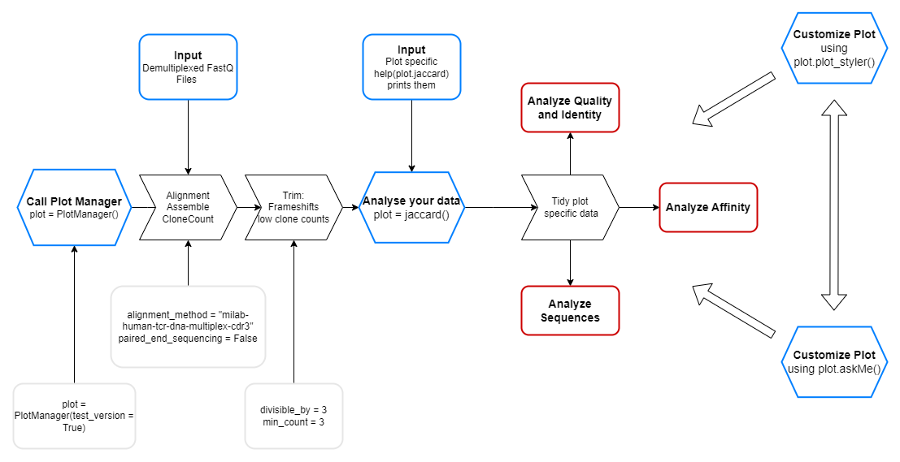

# Welcome to ExpoSeq

ExpoSeq is a powerful pipeline for processing and analyzing FASTQ files from sequencing phage Display panning samples. By using the pipeline you can receive your plots in only 2 steps. The pipeline focuses on analysing the identity between samples but also applies various clustering techniques to analyse the relation between the sequences. Furthermore you can add binding data to relate the clusters to affinity. It utilizes [MiXCR](https://docs.milaboratories.com/mixcr/getting-started/installation/) to align and assemble from high-throughput sequencing data.

## Installation

open a new project and pull the repository (link in browser) to your IDE. If you have Git installed you can also do: ```git clone https://github.com/YOUR_USERNAME/ExpoSeq ``` . Then, install the libraries with ```pip install -r requirements.txt```

To get started, please download and follow the instructions for MiXCR under the following link: https://docs.milaboratories.com/mixcr/getting-started/installation/ 
You can also only use the test version without installing it.

## Importing the Plotting Tool

To access the plotting tool, you will need to import it into your console by running the following command:
```from expoSeq import PlotManager```
## Using the PlotManager

The PlotManager is the main interface for creating various plots using your FASTQ data. You can create an instance of the PlotManager by running the following command:
```plot = PlotManager()```
To use the PlotManager to create plots, you will need to upload your FASTQ data to the pipeline. This will automatically happen as soon as you have called the PlotManager. In the following you can obtain an insight in the worklow of the pipeline after the initial call. There, the blue boxes indicate your input, gray are optional inputs while black and red are processing steps and output, respectively.

If you just want to test the pipeline and see its functions you can call: ```plotting = PlotManager(test_version = True)```

Once you have called the test version or have finished the data processing, you can use the PlotManager to create a variety of plots, such as an identity plot based on the jaccard similarity. Here is an example of how to create this type of plot:
```plot.jaccard()```
If you want to change the style of the plot you can use the PlotManager. If you called it ```plot``` you can do for instance the following: ```plot.style.title_xaxis("your_title")``` 
If you want to implement further plot change you can also refer to the matplotlib.pyplot library and change it in the same way as following:
```import matplotlib.pyplot as plt```
```plt.xlabel("your_title")```
If you need further help you can also ask the chatbot which is based on gpt3. Therefore call: ```plot.askMe()``` . Yet it is not trained on the package but you can use it to customize your graphs. 
If you would like to have details about the inputs and functions of the PlotManager call: ```help(plot)``` . You can also call ```help(plot.jaccard)```


